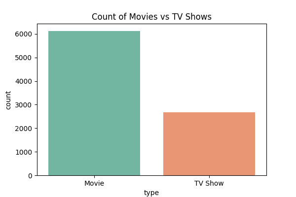
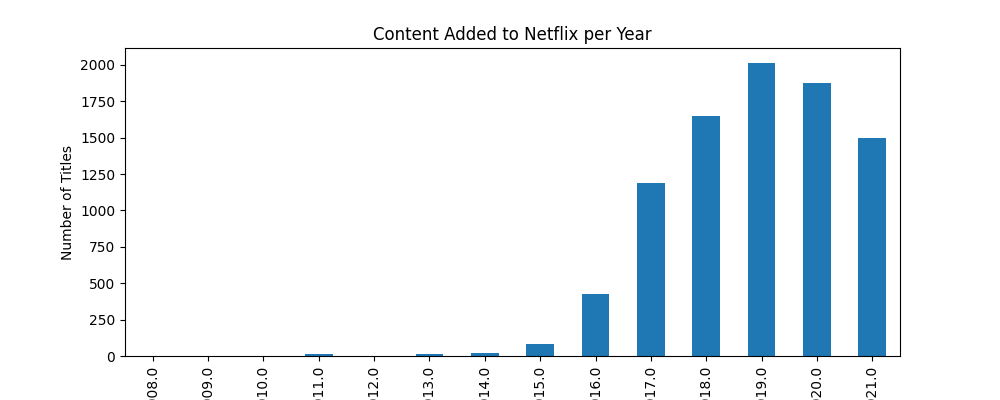
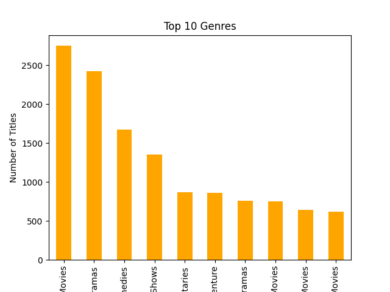
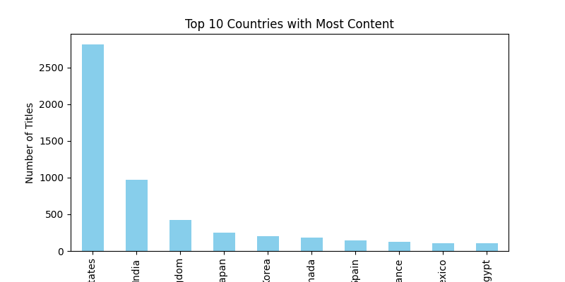

# 📺 Netflix Data Analysis

A data analysis project using Python to explore and visualize insights from Netflix's global content library. This project covers trends in content type, genre, release years, and country distribution using data from Kaggle.

---

## 📊 Project Highlights

- Cleaned and analyzed 6,000+ Netflix titles from 190+ countries
- Visualized trends by year, genre, country, and content type
- Extracted insights into Netflix's global content strategy
- Used `pandas`, `matplotlib`, and `seaborn` for analysis and visuals

---

## 📁 Dataset

- Source: [Netflix Movies and TV Shows Dataset on Kaggle](https://www.kaggle.com/datasets/shivamb/netflix-shows)
- Contains information like:
  - Title, Type (Movie/TV Show)
  - Country, Genre, Cast, Director
  - Date Added to Netflix
  - Rating, Duration, and Description

---

## 🛠️ Technologies Used

- Python
- Jupyter Notebook
- pandas
- matplotlib
- seaborn

---

## 📷 Sample Visualizations

> Top Content Types  
> 

> Content Added Over Time  
> 

> Top 10 Genres  
> 

> Most Frequent Countries  
> 

---

## 🧠 Insights Explored

- Is Netflix releasing more content year over year?
- What genres dominate the platform?
- Which countries produce the most Netflix content?
- Are TV shows or movies more prevalent?

---

## 🚀 How to Run This Project

1. Clone this repository:
   ```bash
   git clone https://github.com/Scribbzz/netflix-data-analysis.git
   cd netflix-data-analysis

2. Install dependencies
   pip install pandas matplotlib seaborn

3. Open the Jupyter notbook
   jupyter notebook notebooks/netflix_analysis.ipynb

4. Make sure the dataset(netflix_titles.csv) is in the data/ folder

## 📈 To-Do (Future Improvements)
- Add interactive dashboard using Streamlit

- Merge with Amazon/Disney+ datasets for platform comparison

- Analyze director/actor patterns using network graphs

## 📄 License
This project is open-source and available under the MIT License.